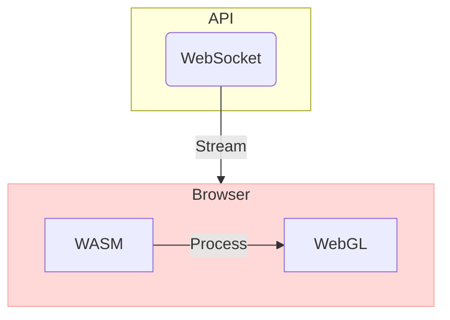

# Terminal

## Tech Stack

- WebAssembly
  - [empscripten](empscripten/README.md)
- WebSocket
- [WebGL](webgl/README.md)

---

## Architecture

### pros and cons

#### advantages

1. Real-time communication
2. Efficient data processing
3. High-performance rendering
4. Scalability
5. Browser compatibility

  
read more...

  
1. **Real-time communication**: WebSocket allows for bidirectional communication between the server (API) and the client (Browser), making it suitable for real-time applications and reducing latency.
2. **Efficient data processing**: WASM is a binary instruction format designed for secure and fast execution, enabling efficient processing of the data received from the WebSocket.
3. **High-performance rendering**: WebGL is a JavaScript API for rendering interactive 2D and 3D graphics in the browser, allowing for high-performance graphics without the need for plugins.
4. **Scalability**: This architecture allows the server to handle multiple WebSocket connections concurrently, enabling the system to scale effectively.
5. **Browser compatibility**: Since both WebAssembly and WebGL are supported by modern web browsers, the architecture is compatible across different platforms and devices.

#### disadvantages

1. Limited browser support
2. Complexity
3. Security concerns
4. Potential performance bottlenecks
5. Dependency on JavaScript

  
read more...

1. **Limited browser support**: Older browsers may not support WebSocket, WebAssembly, or WebGL, which could limit the reach of the application.
2. **Complexity**: The architecture might be more complex compared to a traditional RESTful API, increasing the learning curve for developers.
3. **Security concerns**: WebSocket connections might be vulnerable to security threats like cross-site WebSocket hijacking. Also, WebAssembly code execution can expose vulnerabilities that need to be mitigated.
4. **Potential performance bottlenecks**: While WASM and WebGL are designed for high-performance, some devices might still struggle with the processing and rendering tasks, particularly in resource-intensive applications.
5. **Dependency on JavaScript**: While WASM is intended to be a low-level virtual machine that runs code at near-native speed, it still relies on JavaScript for various functionalities, such as interacting with the DOM or handling events, which can be a potential bottleneck in some cases.

---

## Code

### WebAssembly

#### hello world

- helloworld: [main.c](empscripten/src/helloworld/main.c)

### WebSocket

#### simple server-client

- server: [readme](websocket/src/server/README.md), [src/main.rs](websocket/src/server/src/main.rs)
- client: [readme](websocket/src/client/README.md), [index.js](websocket/src/client/index.js)

### WebGL

#### simple canvas

- canvas: [readme](webgl/src/canvas/README.md)

---

## Ref

- Start [OpenBB](openbb/README.md)
