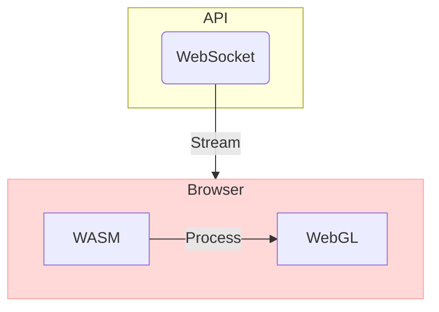

# Terminal

## Tech Stack

- WebAssembly
  - [empscripten](empscripten/README.md)
- WebSocket
- [WebGL](webgl/README.md)

---

## Architecture

---

## Code

### WebAssembly

#### hello world

- helloworld: [main.c](empscripten/src/helloworld/main.c)

### WebSocket

#### simple server-client

- server: [readme](websocket/src/server/README.md), [src/main.rs](websocket/src/server/src/main.rs)
- client: [readme](websocket/src/client/README.md), [index.js](websocket/src/client/index.js)

### WebGL

#### simple canvas

- canvas: [readme](webgl/src/canvas/README.md)

---

## Ref

- Start [OpenBB](openbb/README.md)
