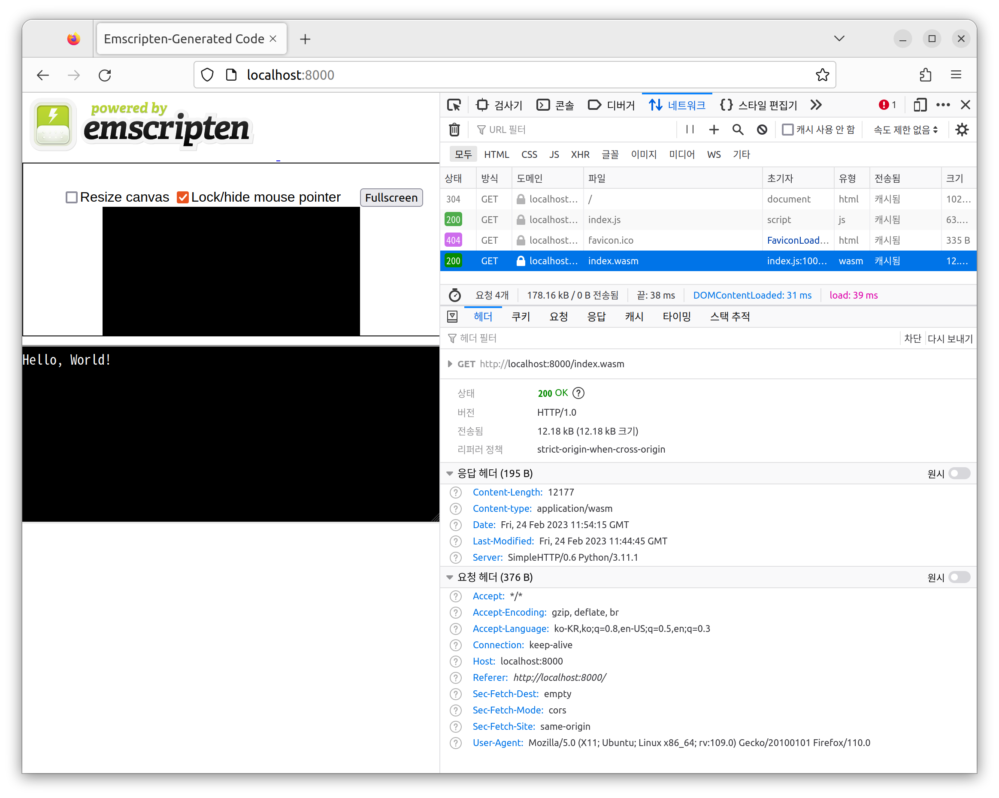

# Emscripten

- [emscripten.org](https://emscripten.org/index.html)
- github: [emscripten-core](https://github.com/emscripten-core)

## Install

- emscripten: [download](https://emscripten.org/docs/getting_started/downloads.html)
- github: [Emscripten SDK](https://github.com/emscripten-core/emsdk)

### Install CMake, LLVM, Clang, Node, Python

- rurumimic/supply/tools
  - [cmake](https://github.com/rurumimic/supply/blob/master/tools.md#cmake)
  - llvm/[clang](https://github.com/rurumimic/supply/blob/master/tools.md#clang): v17
- rurumimic/supply/[node](https://github.com/rurumimic/supply/blob/master/languages/node.md): v16
- rurumimic/supply/[python](https://github.com/rurumimic/supply/blob/master/languages/python.md): v3.11

### Install emsdk

```bash
cd ~/.local/share

git clone https://github.com/emscripten-core/emsdk.git

# delete:
# rm -rf ~/.local/share/emsdk
```

```bash
# ~/.zshrc
export PATH="$PATH:$HOME/.local/share/emsdk"
export EMSDK_QUIET=1
source $HOME/.local/share/emsdk/emsdk_env.sh
```

### Install Tools

- [emscripten](https://github.com/emscripten-core/emscripten)
- [binaryen](https://github.com/WebAssembly/binaryen)

```bash
emsdk list
emsdk install emscripten-main-64bit binaryen-main-64bit
emsdk activate emscripten-main-64bit binaryen-main-64bit
```

#### Check Installation

```bash
emsdk list

The following tools can be compiled from source:
    (*)    emscripten-main-64bit     INSTALLED
    (*)    binaryen-main-64bit       INSTALLED

Items marked with * are activated for the current user.
Items marked with (*) are selected for use, but your current shell environment is not configured to use them. Type "source ./emsdk_env.sh" to set up your current shell to use them.
```

##### emsdk help

```bash
emsdk help
```

##### emcc version

```bash
emcc -v

emcc (Emscripten gcc/clang-like replacement + linker emulating GNU ld) 3.1.35-git (de7cbc56c3ac38b83cc3e8bbc17ac5fbb6b3bbd7)
Ubuntu clang version 17.0.0 (++20230326042432+943df86c82b1-1~exp1~20230326042544.827)
Target: wasm32-unknown-emscripten
Thread model: posix
InstalledDir: /usr/bin
```

---

## Hello World

- [tutorial](https://emscripten.org/docs/getting_started/Tutorial.html)

[src/helloworld/main.c](src/helloworld/main.c):

```c
#include <stdio.h>

int main() {
  printf("Hello, World!\n");
  return 0;
}
```

### Compile C

```bash
emcc main.c
```

```bash
helloworld/
├── a.out.js
├── a.out.wasm
└── main.c

0 directories, 3 files
```

Run Javascript:

```bash
node a.out.js

Hello, World!
```

### Compile HTML

```bash
emcc main.c -o index.html
```

Run a Local Server: [localhost:8000](http://localhost:8000)

```bash
python -m http.server

Serving HTTP on 0.0.0.0 port 8000 (http://0.0.0.0:8000/) ...
127.0.0.1 - - [24/Feb/2023 20:53:00] "GET / HTTP/1.1" 200 -
127.0.0.1 - - [24/Feb/2023 20:53:00] "GET /index.js HTTP/1.1" 200 -
127.0.0.1 - - [24/Feb/2023 20:53:00] "GET /index.wasm HTTP/1.1" 200 -
```


