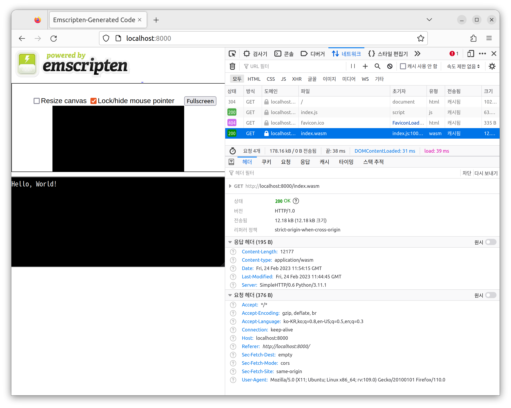

# Emscripten

- [emscripten.org](https://emscripten.org/index.html)
- github: [emscripten-core](https://github.com/emscripten-core)

## Install

- emscripten: [download](https://emscripten.org/docs/getting_started/downloads.html)
- github: [Emscripten SDK](https://github.com/emscripten-core/emsdk)

```bash
# mac
cd ~/.local/share

git clone https://github.com/emscripten-core/emsdk.git

# ~/.zshrc
export PATH="$HOME/.local/share/emsdk:$PATH"
export EMSDK_QUIET=1
source $HOME/.local/share/emsdk/emsdk_env.sh
```

### Install latest

```bash
emsdk list
emsdk install latest
emsdk activate latest
```

```bash
emsdk help
emcc -v
```

### Hello World

[helloworld/main.c](helloworld/main.c):

```c
#include <stdio.h>

int main() {
  printf("Hello, World!\n");
  return 0;
}
```

#### Compile C

```bash
emcc main.c

shared:INFO: (Emscripten: Running sanity checks)
cache:INFO: generating system asset: symbol_lists/115065….txt... (this will be cached in "…/upstream/emscripten/cache/symbol_lists/115065….txt" for subsequent builds)
cache:INFO:  - ok
```

```bash
helloworld/
├── a.out.js
├── a.out.wasm
└── main.c
```

Run Javascript:

```bash
node a.out.js

Hello, World!
```

#### Compile HTML

```bash
emcc main.c -o index.html
```

Run a Local Server: [localhost:8000](http://localhost:8000)

```bash
python -m http.server

Serving HTTP on 0.0.0.0 port 8000 (http://0.0.0.0:8000/) ...
127.0.0.1 - - [24/Feb/2023 20:53:00] "GET / HTTP/1.1" 200 -
127.0.0.1 - - [24/Feb/2023 20:53:00] "GET /index.js HTTP/1.1" 200 -
127.0.0.1 - - [24/Feb/2023 20:53:00] "GET /index.wasm HTTP/1.1" 200 -
```



