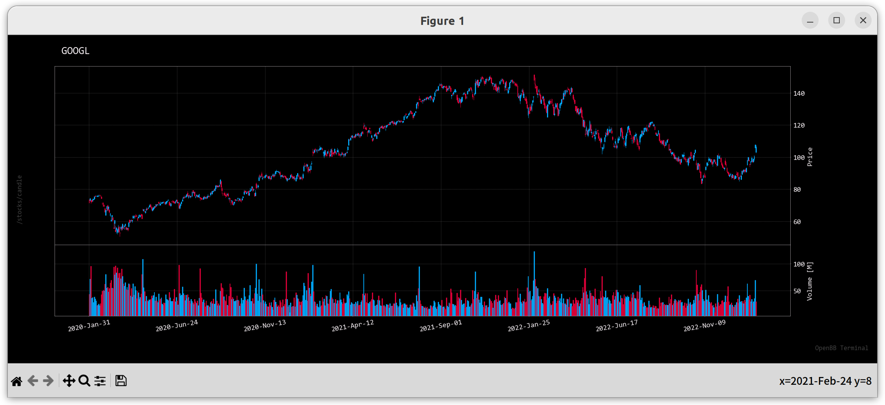
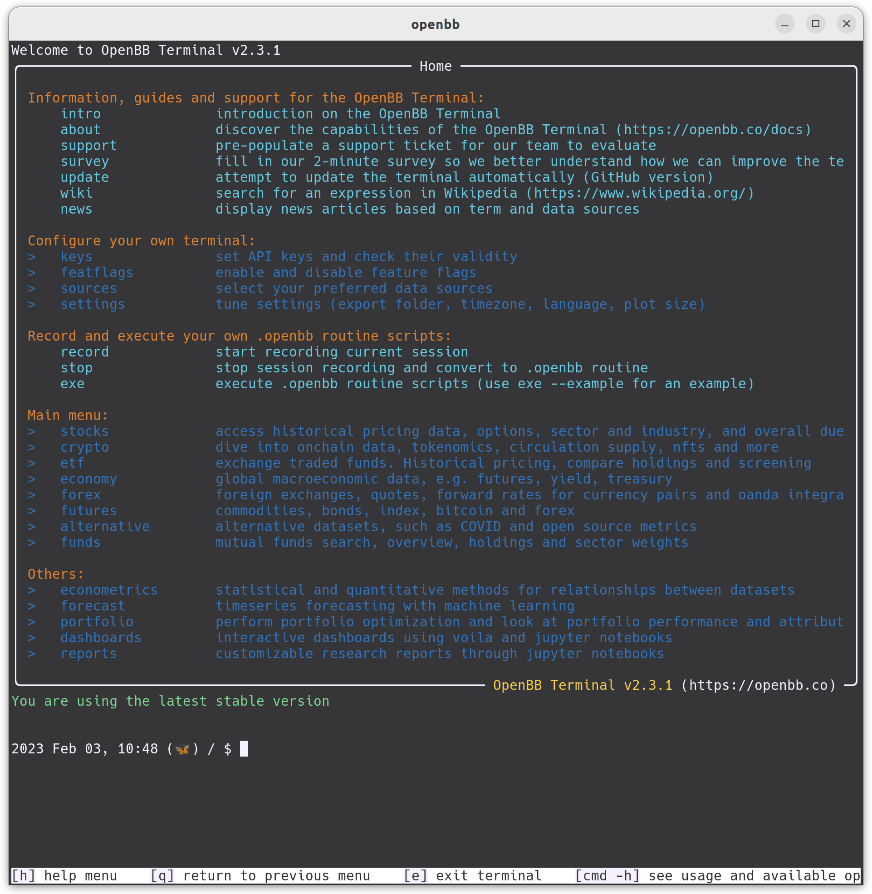

# OpenBB



- [OpenBB](https://openbb.co/)
  - [pricing](https://openbb.co/pricing)
  - [blog](https://openbb.co/blog)
- github: [OpenBB Terminal](https://github.com/OpenBB-finance/OpenBBTerminal)
- demo: [youtube](https://youtu.be/fqGPK8OVHLk)
- [docs](https://docs.openbb.co/)
  - [terminal](https://docs.openbb.co/terminal)
  - [sdk](https://docs.openbb.co/sdk)

## Install OpenBB Terminal

- setup [python](https://github.com/rurumimic/supply/blob/master/languages/python.md) development enviroment: pyenv, autoenv, poetry

clone git repo:

```bash
git clone https://github.com/OpenBB-finance/OpenBBTerminal.git
cd OpenBBTerminal/
```

activate python 3.9.6 virtualenv:

```bash
pyenv install --list | grep 3.9.6
pyenv install 3.9.6
pyenv virtualenv 3.9.6 openbb
pyenv activate openbb

python -V # Python 3.9.6
```

install all dependencies:

- [conda-3-9-env-full.yaml](https://github.com/OpenBB-finance/OpenBBTerminal/blob/develop/build/conda/conda-3-9-env-full.yaml)
- [pyproject.toml](https://github.com/OpenBB-finance/OpenBBTerminal/blob/develop/pyproject.toml)

```bash
pip install --upgrade pip setuptools==64.0.2 lightgbm
poetry install -E all
```

## Start OpenBB Terminal

reopen shell and:

```bash
openbb
```


