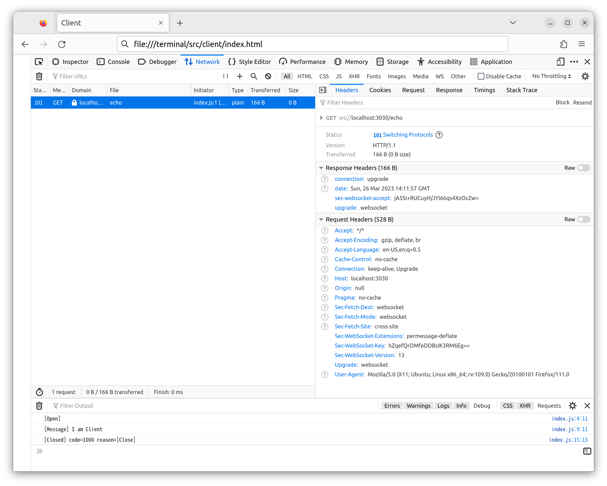

# Server

```bash
cargo new server
cargo add warp
cargo add tokio --features full
```

```bash
cargo run
```

```bash
curl http://localhost:3030

Hello, world!
```

## Client

1. [Start a client](../client/README.md):

Open in browser: `client/index.html`


